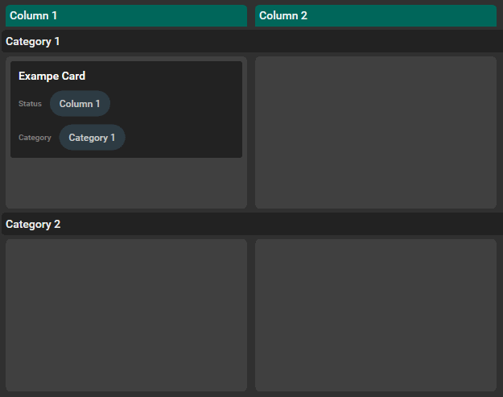

# Bored Brain

## What is Bored Brain?

Bored Brain is a simple but highly customizable board app for Windows that works completely offline. The main purpose of this app is to help with self organization, but I'm sure there are a lot of different use-cases it can be used for. 


---

## The Idea

To give you a rough understanding of the basic idea, here are the main requirements I had in mind:

### Customizable Columns / Groups

For full flexibility the columns can be defined by any field that has single selectable options. To allow further flexibility a second field can be used to group the cards into categories.

### Customizable Card Fields

A basic card has a title and text-content. But there may be many different properties you want to add to a card. The app should offer the flexibility to create a card structure that matches your needs.

### Based on local files for maximum data protection

The app does not force you to store your personal data or any of the contents of your board on a server you have no control over. The whole board is based on local files and does not require a internet connection to work. Your data is yours and yours alone.

### Easy to read file formats

To allow further processing by other tools and the possiblity to modify the underlying strucutre by hand, all data is stored in JSON-Format. This makes it easy to read for humans and machines alike. This way your data is not completely lost if this app should ever stop working.

---

## Limitations

Of course there are a few limitations caused by those requirements:

- No build-in synchronization across multiple devices
- No build-in collaboration-tools / sharing
- No backup

You can take care of synchronization yourself, if you need to. Because everything is based on files the only thing you need to do is synchronize those files across devices. Keep in mind that the app does not reload changes from the file system while it is running so you need to restart the application after all files are synchronized.

I recommend to backup your data regularly. Due to this app working with local files, everything will be lost if you lose access to your system for whatever reason (broken harddisks for example).

---

## Features

### Manage multiple boards

Create, load and modify boards using the board menu.


#### Create board
Creates a new board inside a chosen folder.

#### Open boards
Loads a board from a folder with a board structure inside. Chose the ```board.json``` file to open the board.

#### Edit Structure
Opens a dialog where you can modify the card structure of the current board. See [Customize card structure](#customize-card-structure) for more details.

---

### Customize card structure

The basic structure of a card is a title and text-content. This structure can be customized by adding different fields to the structure of all cards on the same board. The following fields are currently supported:
- Text fields
- Number fields (only integers for now)
- Date fields (only dates without times for now)
- Select fields
- Multiselect fields

The ```Edit Structure Dialog``` allows you to change the structure of cards on the current board:


The top part of the dialog lists the existing fields (in this case a *Status* field of type *select* with the possible value *'None'* and a *text* field called *ExampleField*). Use the ```Show on card```-Checkbox to show additional fields on the board view.

Select fields and multiselect fields have a list of possible values that will be displayed in a dropdown list on the cards. Remove existing Values by clicking the ```X``` next to them. Add new values using the text field and the ```+```-button.

New fields can be added using the Section on the bottom of the fields list. Type a name and choose a type to add a new field to your structure. To delete a field use the trash can button in the bottom right corner of the fields area.

Click the ```Save```-button to save your changes and apply them to existing cards. Click the ```Cancel```-button or the ```X``` in the top right corner to close the dialog without saving. 


> ### Warning: All changes to the structure will be applied to all cards after saving. Be careful when deleting fields or values. Your changes can not be undone and the contents on the cards will be lost!

---

### Change board view

The columns and categories of a board can be constructed from any select field in the card structure. This allows different views on the same cards. Use the dropdown fields on the top of the board view to change the column and category fields:


The column field is mandatory, the category field is optional and can be reset using the ```Clear Category```-button.

> ### Note: Only select fields can be used for columns and categories for now. Other fields have no clear behaviour when moving cards on the board.

---

### Create new card

Use the ```Create Card```-button to create new cards.


The ```Edit Card```-Dialog allows you to enter the contents for the new card.


---

### Create Column

Use the ```Create Column```-button to add a new value to the current column field:


Enter the column name and click ```Add``` to add the column to the board. This will create a new value on the current column field.


You can also edit the structure of the board manually and add a new value to the current column field (see [Customize card structure](#customize-card-structure)). The result will be exactly the same. The ```Create Column```-button is only a shortcut for adding new values to the current column field.


---

### Move Card

Drag and drop a card to move it across the board. This will change the value of the current column field on the card accordingly. If the board is also using categories, moving to another category will also change the value of the current category field.



---

### Edit Card

Click on a card to edit it. The dialog is almost the same dialog that is used to create a new card:


The only difference is the ```Delete```-button in the bottom left corner. This will move the card to an archive folder and remove it from the current board.

> ### Note: To avoid accidental data loss cards are not deleted from disk. They are moved to an ```archive``` folder inside the ```cards``` folder of the current board. To remove them permanently, please clear the ```archive``` folder manually. To restore a card that was deleted by accident, find it in the ```archive``` folder and move it back to the ```cards``` folder. The card will be added to the board after the next restart of the application.